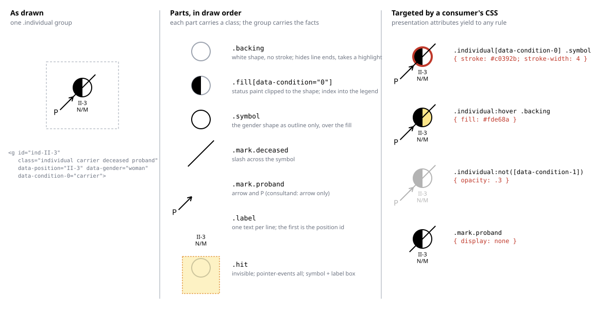

# Design: the SVG output contract (hooks for interactive use)

**Status:** proposed **Related:** [`renderer.md`](renderer.md) (what is drawn and where; this doc is about how the
drawing is organised in the document), [`ir.md`](ir.md) (the identities and facts the hooks carry).

## Overview

The renderer's SVG gains structure without changing what it draws. Every individual, mating, sibship and generation
marker becomes a group that names the IR fact it draws — the drawn position such as `II-3`, gender, clinical status per
condition, deceased, proband — as an id, classes and data attributes. The pedigree itself carries its ordered condition
legend. Nothing else changes: same geometry, same glyphs, no stylesheet and no script in the file.

That is enough for the interactive figures the output feeds. A legend built outside the SVG can find every individual
who carries a condition and restyle them with one CSS rule, because the renderer sets appearance through presentation
attributes, which any stylesheet rule overrides. Two things are deliberately not offered: the renderer does not draw the
legend, and labels do not reflow. Label extents are an input to the layout, so a bigger font must move nodes; the
substitute is a minimum label box — "every label fits in 20em by 3em" — that the spacing reserves whether or not the
drawn labels need it, so a consumer can replace or enlarge label text within that box without collisions.

## Background

The SVG today is a flat list of shapes, lines and text in draw order (`renderer.md`, Drawing). Nothing in it says which
rectangle is `II-3` or that a given text line is her genotype. A consumer that wants to highlight an individual has to
reconstruct that from coordinates, which is exactly the geometry the IR was designed to keep out of the contract.

Two properties of SVG shape the design. First, the renderer sets colour and stroke with *presentation attributes*
(`fill="#000000"` on the element), not inline `style`. In the cascade a presentation attribute has lower precedence than
any author stylesheet rule, so a consumer's CSS wins without the renderer knowing about it. Second, an `id` must be
unique in the document, and a composed figure holds several pedigrees, each drawn in its own nested `<svg>`; the
renderer already prefixes each tile's clip-path ids so tiles do not collide.

The renderer is deterministic and its goldens are byte-compared. Any change to the emitted markup changes every golden
once and is reviewed as a rendering change (`CLAUDE.md`, Committing).

## Non-goals

- **No stylesheet or script in the output.** The renderer describes the drawing; the consumer owns its behaviour and
  theme. An embedded `<style>` would fight the consumer's stylesheet and would change the goldens with every theme.
- **No drawn legend.** Where a legend sits, and whether it is a list, a key or a control, is the consumer's layout
  decision; the round-trip judge does not need one; and a drawn legend would resize every canvas.
- **No label reflow.** A label's estimated width and the tallest label stack set the column and row pitch
  (`renderer.md`, Spacing scales with the labels). Redrawing for a new font size without moving nodes would mean
  re-running the drawing step in the browser — a port of the drawer — for a result SVG text cannot deliver anyway, since
  it does not wrap.
- **No change to layout or glyphs.** The pixel geometry of every golden is identical before and after.

## Design

### Every drawn thing belongs to a group that names its IR fact

The document is organised as groups, one per pedigree element, in the existing draw order. Each group's `class` says
what kind of element it is and which drawn states apply; its data attributes carry the identity and facts a consumer
selects on; its `id` is the drawn position under the tile's prefix. Inside a group the parts keep their own class so a
rule can reach the symbol, a status mark or a label line on its own.

For one individual — a woman at II-3 who carries the pedigree's first condition, is deceased and is the proband — the
emitted markup has this shape (coordinates elided):

```svg
<g id="ind-II-3" class="individual carrier deceased proband" data-position="II-3" data-generation="2"
   data-index="3" data-gender="woman" data-condition-0="carrier">
  <circle class="backing" … fill="#ffffff"/>
  <clipPath id="clip-II-3"><circle …/></clipPath>
  <rect class="fill" data-condition="0" … clip-path="url(#clip-II-3)"/>
  <circle class="symbol" … fill="none" stroke="#000000"/>
  <line class="mark deceased" …/>
  <g class="mark proband"><line …/><line …/><line …/><text …>P</text></g>
  <text class="label" …>II-3</text>
  <text class="label" …>N/M</text>
  <rect class="hit" … fill="none" pointer-events="all"/>
</g>
```

The same individual, taken apart. Left, the group as drawn; middle, each part in draw order with the selector that
reaches it; right, consumer stylesheet rules and what each does to the drawing. Every glyph here is the renderer's own
output, only regrouped and annotated.



#### Layering inside an individual

The parts are drawn in a fixed order chosen so that restyling any one of them renders cleanly and pointer behaviour does
not depend on styling:

1. **`backing`** — the gender shape filled white, no stroke. It hides the ends of lines drawn under the symbol (a ghost
   link runs centre to centre) and is the surface a consumer paints for a selection or hover highlight.
1. **`fill`** — status paint, clipped to the shape: the full shape when affected, a legend-indexed region when a
   carrier. Status is always a `fill` part and never the backing's colour, so one selector reaches all status paint and
   the multi-condition quadrants (`renderer.md`, not yet drawn) join the same scheme.
1. **`symbol`** — the same shape again, stroke only, no fill. Drawn *over* the fill so the outline is whole: today the
   region rectangle is drawn last and covers the inner half of the stroke on the filled side, which is invisible while
   both are black and visibly uneven the moment a consumer colours the stroke. Visually the two orders are identical at
   the default styling, so the goldens' appearance does not change.
1. **`mark`** — slash, presymptomatic line, question mark, arrow: over the outline, as they cross it.
1. **`label`** — the text lines.
1. **`hit`** — a rectangle covering the symbol and the reserved label box, no fill, `pointer-events="all"`, drawn last.
   It is the one element a consumer needs for hover and click: it catches the gaps between a thin arrow, the outline and
   the labels, it does not move when the visible parts are restyled or hidden, and its extent *is* the minimum label box
   below, so a consumer reads the region it may draw into straight from the geometry. Matings get the same treatment, a
   wide transparent stroke over the thin line, so a couple's line is as easy to point at as a symbol.

Two shapes per individual instead of one is the cost; both carry the same coordinates, and the clip path is unchanged.

The groups, and what each promises:

- **`pedigree`** — one per tile, on the nested `<svg>` a composed figure already wraps each pedigree in (and on the root
  of a single-pedigree render). It carries the pedigree's display title and, as a JSON array, its ordered **condition
  legend**: the same order the drawer uses to pick which region of a divided symbol a carrier fills (`renderer.md`,
  Drawing), so index *i* in the array is the condition `data-condition-i` names on every individual below it.
- **`individual`** — one per drawn cell. Identity is the drawn position and its two components; gender; the external id
  when present; and one `data-condition-i` per condition the individual has, whose value is the status (affected,
  carrier, presymptomatic, unknown). State classes mirror the marks drawn: `affected`, `carrier`, `presymptomatic`,
  `deceased`, `proband`, `consultand`. A **ghost** — the duplicated partner of a cross-generation join — is an
  `individual ghost` group with the *same* data attributes as the real cell and a `ghost-` id, so selecting by position
  lights both and selecting by id lights one.
- **`mating`** — the line or double line between an adjacent couple, a routed edge for an overflow mating, or the
  childless glyph. It names both partners' positions and carries `consanguineous` and the childlessness kind as classes.
- **`sibship`** — a descent drop, sib bar, child stubs and any twin bar, as one group naming the parent couple's
  positions (or the single parent's); a founder sibship's hanger is a `sibship founder` group with no parents.
- **`ghost-link`** — the dashed same-individual connector, naming the position it joins.
- **`generation`** — each Roman-numeral marker, naming its row.

Attribute names and the exact class vocabulary are the drawer's to state, in its module docstring, and a test pins them:
each golden parses as XML, every individual in the IR has exactly one non-ghost group, ids are unique, and each group's
position matches the IR. The vocabulary is part of the public contract from the first release that ships it and evolves
additively, like the IR.

### Restyling is the consumer's, through CSS the renderer never sees

Because appearance is set with presentation attributes, a stylesheet rule of any specificity overrides it. A legend that
highlights everyone with the first condition needs one rule and no renderer support:

```css
.individual[data-condition-0] .symbol { stroke: #c0392b; stroke-width: 4; }
.individual:not([data-condition-0]) { opacity: 0.3; }
```

The renderer therefore commits to two things and no more: it keeps setting appearance through presentation attributes,
never `style`, and it keeps the part classes (`backing`, `fill`, `symbol`, `mark`, `label`, `hit`) stable. Hover,
selection, dimming and theming all live in the consumer.

### Ids are unique per document; positions are unique per pedigree

A composed figure prefixes every id with its tile's prefix, as the clip-path ids already are, so `#p1-ind-II-3` is
family 2's II-3 and `[data-position="II-3"]` under a given `pedigree` group is the same cell. A consumer working inside
one tile selects by position; one working across the figure selects by id.

### A semantic change is a re-render, and nodes stay put

The hooks carry meaning out of the drawing; they are not a way to put new meaning in. To show a phenotype the figure did
not have — a new condition on some of its individuals — the consumer adds the condition to the IR and renders again.
That is cheap and exact for a reason worth stating: layout and ordering read only the pedigree's structure and each
individual's stable position, never clinical status, so a re-render with changed conditions draws every node in the same
place and regenerates everything that does depend on them — the solid fill, the carrier regions, and the change from a
two-way split to quadrants once a pedigree has more than two conditions. No stylesheet could do that last step, since it
is new geometry keyed to the legend index.

The boundary between what a consumer's CSS can derive from the hooks and what needs the drawer is the boundary between
paint and geometry. Fills are paint: a stylesheet can point `fill` at a paint server in the document's `defs`, and
hard-stop gradients and object-bounding-box patterns paint a solid, a half, a quadrant or a central dot clipped to the
symbol for free. Marks that leave the shape — the deceased slash, the proband arrow, the question mark, the
presymptomatic line — are elements, and CSS cannot create SVG geometry (generated content is undefined on SVG shapes). A
consumer that wants to change those without a round trip needs a drawer where it runs; see Alternatives.

### A minimum label box stands in for reflow

`Geometry` gains a **minimum label box**: a width and a height, in em of the label size, that the spacing reserves under
every symbol regardless of what the labels contain. The spacing already works as floors under estimates — a column pitch
under the estimated width of each label line, a row pitch under the tallest stack (`renderer.md`, Spacing scales with
the labels) — so the box is one more floor: the reserved width per cell becomes the larger of the estimate and the box,
and the reserved band the larger of the tallest stack and the box. Unset, the output is byte-identical to today.

The promise to a consumer is a box, not a ratio, because a box is something to design against. Told that every label
fits in 20em by 3em, a consumer can set its own font size, swap a genotype for a variant string or add a second line
client-side and know it stays clear of the neighbours and the row below. A ratio makes the same guarantee only relative
to whatever the longest label in *this* pedigree happened to be, which the consumer cannot see and the next re-render
may change. The cost is a wider, taller figure than the content needs, paid only by consumers that set the box.

### Consequences

- Every golden SVG changes once, in one reviewed commit, with renders before and after in the PR to show the drawing did
  not move.
- The output is larger by the group wrappers and attributes, which does not matter for figures and is the price of a
  self-describing file.
- `render_svgs`, which returns one document per pedigree for a carousel, carries the same groups with an empty prefix.
- A deferred pedigree's placeholder is a `pedigree deferred` group, so a consumer can tell a missing family from an
  empty one.

## Alternatives considered

- **Ids only, no data attributes.** Enough for a consumer that also holds the IR and can map ids back to facts.
  Rejected: the legend use case wants the SVG to be self-describing so a static page can drive it, and data attributes
  cost nothing at render time.
- **A `<style>` block with a class vocabulary for theming.** Tempting for a consistent look across consumers. Rejected:
  it makes the renderer own presentation it has no opinion on, fights the consumer's cascade, and turns every theme
  change into a golden change.
- **Draw the legend into the SVG.** Rejected as a non-goal above; a consumer that wants one can build it from the
  pedigree group's condition array in a few lines.
- **A drawer in the browser.** Re-running the drawing step client-side would give label reflow and let a consumer change
  marks without a round trip. Deferred, not rejected: the likely shape is a TypeScript port of the renderer, glyphs and
  layout both, kept in agreement with the Python by the same goldens. Not now — two drawers to hold to glyph-level
  agreement is a cost to take on when a consumer needs it, and until then the minimum label box covers text and a
  re-render covers meaning.
- **A reservation factor instead of a box.** Multiply the label size by a factor in the spacing computation and let a
  consumer scale text by up to that factor. Simpler to implement, and it needs no new unit. Rejected: the guarantee it
  gives is data-dependent — spaced for 1.5 times the longest label in this pedigree — so a consumer cannot reason about
  it without the data, and two pedigrees rendered with the same factor offer different room.
- **Per-condition classes instead of `data-condition-i`.** Classes such as `cond-0-carrier` are shorter to select but
  cannot carry the status as a value, and a condition's name is free text that does not slug safely. The index into the
  pedigree's legend array is stable and the status rides as the attribute value.

## Open questions

- **Accessibility.** A `<title>` child on each individual group gives native hover tooltips and a screen-reader name for
  free, but an interactive consumer usually supplies its own and may not want the browser tooltip. Emit it, or leave it
  to the consumer?
- **Which annotations to expose.** Each annotation is already drawn as a label line, so exposing its type as a class on
  that line (`label genotype`) costs nothing and lets a consumer hide or restyle a category. Worth doing in the first
  cut, or wait for a use?
- **Mating status.** Separation and divorce are in the IR but not yet drawn (`renderer.md`, Drawing). Should the mating
  group carry the status as a class ahead of the glyph, so a consumer can show it, or wait until the renderer draws it?
